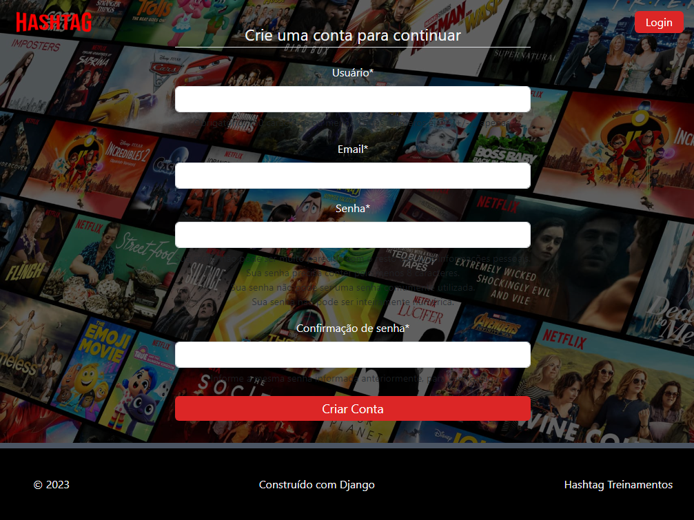

# Hashflix - Réplica da Netflix

***NOTA**: o deploy deste projeto seria inicialmente feito no [Heroku](https://www.heroku.com/), porém desde dezembro de
2022 ele não possui mais planos gratuitos para deploy. A alternativa seria o [Railway](https://railway.app/) que possui
um plano de deploy de 500 horas gratuitas, porém eu já utilizei as 500 horas para o deploy de outro projeto. Como este
projeto é para fins de estudos, eu não pretendo pagar um servidor para fazer o deploy (isso pode mudar eventualmente
quando minha situação financeira mudar).* 

*Neste arquivo contém uma descrição detalhada de cada parte deste projeto, contém imagens de como o site se comporta em cada tela
e com a garantia da criadora do site (eu) de que o site está 100% funcional.*

## Conteúdo

- [Visão Geral](#visão-geral)
  - [O projeto](#o-projeto)
  - [A plataforma](#a-plataforma)
- [Meu processo de criação](#meu-processo)
  - [Construído com](#construído-com)
  - [Fontes úteis](#fontes-úteis)
- [Autora](#autora)

## Visão Geral

Este projeto é uma réplica da Netflix construída inteiramente com Python utilizando o [Django](https://docs.djangoproject.com/pt-br/4.2/). 

É uma réplica 100% funcional e com uma estrutura visual bastante parecida com a da Netflix.

O projeto faz parte da ementa do curso Python Impressionador oferecido pela [Hashtag Treinamentos](https://www.hashtagtreinamentos.com/), portanto todos os "filmes" e "séries" contidos no projeto se tratam de vídeos aula e conteúdos dos cursos oferecidos pela empresa.
 

### O projeto

Ao entrar na plataforma o usuário vê uma tela inicial com a opção de fazer login e/ou criar uma conta. Ao fazer login, o usuário é encaminhado para a tela onde estão armazenados todos os "filmes"/"séries".

O site contém um sistema que contabiliza a quantidade de visualizações de um conteúdo, sendo possível assim a criação da aba "Em Alta", que mostra para o usuário os conteúdos com mais visualizações dentro da plataforma. Possui também um sistema que registra um conteúdo acessado pelo usuário, permitindo assim a criação da aba "Continue Assistindo".

### A plataforma

Aqui estão alguns capturas de tela direto do meu projeto:

**Homepage:** tela inicial ao entrar no site, possui algumas informações e as opções para fazer login ou para criar uma conta

**Login:** tela que permite que o usuário faça login na plataforma

**Criação de conta:** tela que permite que o usuário crie uma conta nova na plataforma, caso ainda não possua uma conta

**Tela inicial:** tela após o usuário fazer o login. Ela possui:
- Barra de navegação com:
  - barra de pesquisa
  - botão para fazer logout na conta
  - botão para editar o perfil
- Destaque: que no caso foi definido como o conteúdo mais recente adicionado na plataforma
- Novo: um carrossel contendo uma lista dos conteúdos dos mais novos para os mais antigos na plataforma
- Em Alta: um carrossel contendo uma lista dos conteúdos mais acessados na plataforma 
- Continuar Assistindo: um carrossel com os conteúdos já acessados anteriormente pelo usuário

**Detalhes do conteúdo:** quando se escolhe um conteúdo para assistir, abre-se a tela com os detalhes deste conteúdo: descrição, episódios disponíveis e os conteúdos relacionados (conteúdos que estão na mesma categoria). Neste projeto não foi criado um player de vídeo próprio, então ao dar play no conteúdo ou escolher um dos episódios, o usuário será redirecionado para um vídeo do Youtube (de forma embedada no navegador) 

**Editar Perfil:** tela que permite ao usuário alterar suas informações de acesso

## Meu processo de criação

### Construído com

Como dito anteriormente, este projeto foi inteiramente construído com [Django](https://docs.djangoproject.com/pt-br/4.2/), framework do python. 

O Django é um framework com configurações bastante complexas, mas que permitiram a construção de um projeto bastante completo, a criação de uma base de dados de forma bastante simples e um gerenciamento ada base de dados bastante simples, visto que a página administraiva do Django é bastante intuitiva

### Fontes úteis

- [Stack Overflow](https://stackoverflow.com/#) - for bastante útil no processo, tanto para consertar algum eventul bug que foi aparecendo no meio do caminho, quanto para esclarecer algma dúvida sobre alguma estrutura de código específica.

## Autora

Confira minhas redes sociais:

     

     

